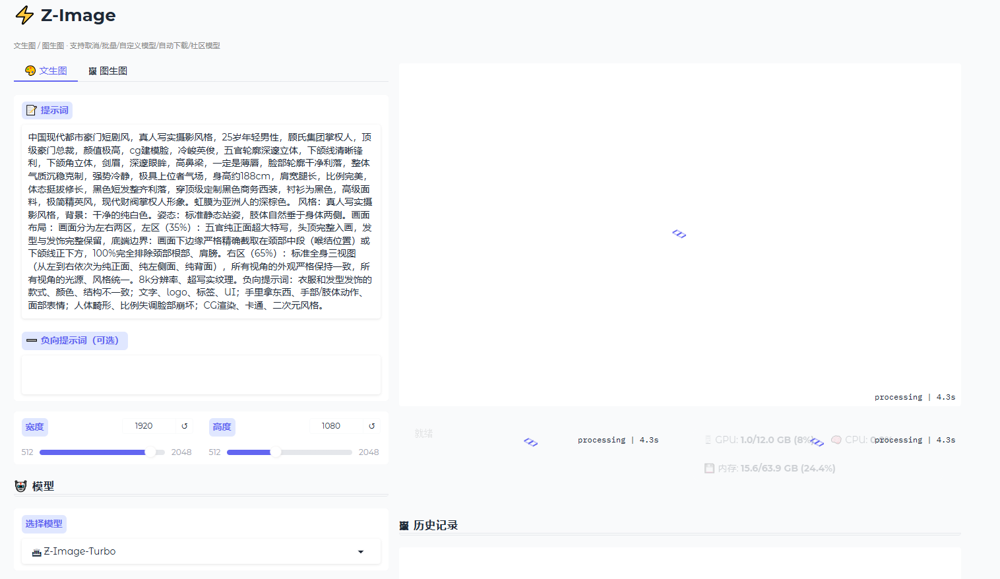
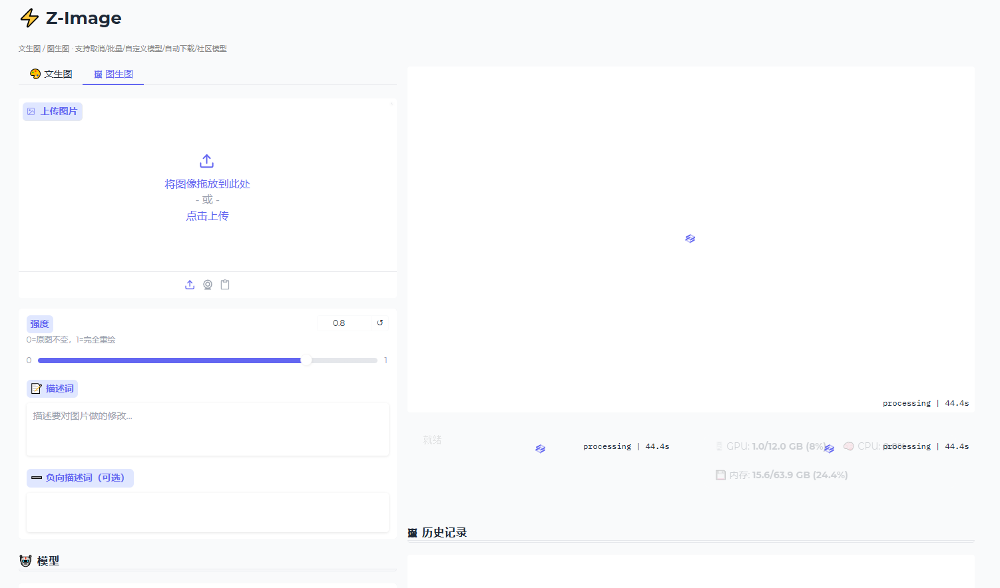
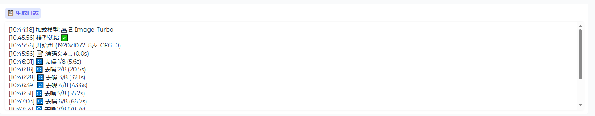

# Z-Image WebUI

基于 [Z-Image](https://github.com/Tongyi-MAI/Z-Image) 的本地推理 WebUI，支持 txt2img / img2img，带有 CPU offloading 以降低显存占用。

## Features

- **文生图 (txt2img)** — 输入提示词直接生成图像
- **图生图 (img2img)** — 以一张参考图为基础生成新图像
- **CPU Offloading** — 逐层加载到 GPU，12GB 显存也能跑 6B 模型
- **多模型支持** — 支持多个社区模型切换
- **批次生成** — 一次生成多张图像
- **批量计数** — WebUI 直接选择生成张数

## Screenshots

| 界面概览 | 生成进度 |
|:---:|:---:|
|  |  |
| **历史记录** | **参数设置** |
|  |  |
| **文生图** | **图生图** |
|  |  |
| **模型选择** | **系统监控** |
|  | |

## Quick Start
#### (1) PyTorch Native Inference
Build a virtual environment you like and then install the dependencies:
```bash
pip install -e .
```
Then run the following code to generate an image:
```bash
python inference.py
```

#### (2) WebUI (Gradio)

Launch an interactive Gradio WebUI for text-to-image and image-to-image generation:

```bash
# Install dependencies (if not already done)
pip install -e .

# Start the WebUI
python webui.py
```

Then open http://localhost:7860 in your browser.

On Windows, you can also double-click `start.bat` to launch.

## Model Weights

模型权重自动下载到 `ckpts/` 目录：

```
ckpts/
├── Z-Image-Turbo/                   # 官方 Turbo（自动下载）
├── Z-Image/                         # 官方 Base（自动下载）
├── Z-Image-Turbo-FP8/               # FP8 低显存版（自动下载）
└── community/                       # 社区模型（需手动下载）
    ├── juggernaut_z/
    └── unstable_revolution_zit/
```

**官方模型**（HF 仓库）：首次在 WebUI 选择后自动从 HuggingFace 下载。

**社区模型**（CivitAI 单文件）：需手动从 CivitAI 下载 `.safetensors` 文件放入对应目录。

如果另一台机器已有 `ckpts/`，直接复制过去即可跳过下载。
